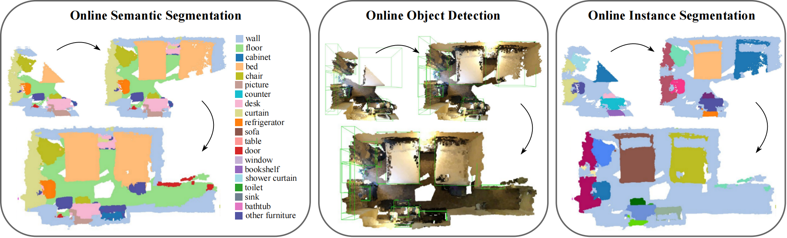

# Memory-based Adapters for Online 3D Scene Perception

## Introduction

This repo contains PyTorch implementation for paper [Memory-based Adapters for Online 3D Scene Perception](https://arxiv.org/abs/2403.06974) based on [MMDetection3D](https://github.com/open-mmlab/mmdetection3d). Look here for [中文解读](https://zhuanlan.zhihu.com/p/704435537).

> Memory-based Adapters for Online 3D Scene Perception  
> [Xiuwei Xu](https://xuxw98.github.io/)*, Chong Xia\*, [Ziwei Wang](https://ziweiwangthu.github.io/), [Linqing Zhao](https://scholar.google.com/citations?user=ypxt5UEAAAAJ&hl=zh-CN&oi=ao), [Yueqi Duan](https://duanyueqi.github.io/), [Jie Zhou](https://scholar.google.com/citations?user=6a79aPwAAAAJ&hl=en&authuser=1), [Jiwen Lu](http://ivg.au.tsinghua.edu.cn/Jiwen_Lu/)
>



We propose a model and task-agnostic plug-and-play module, which converts offline 3D scene perception models (receive reconstructed point clouds) to online perception models (receive streaming RGB-D videos).

## News
- [2025/2/11]: Check out our recent work [EmbodiedSAM](https://github.com/xuxw98/ESAM) (ICLR'25 Oral), an online and real-time 3D segmentation anything model!
- [2024/3/07]: Code released. Paper will be uploaded to Arxiv in next week.
- [2024/2/27]: Our paper is accepted by CVPR 2024.

## Method
Overall pipeline of our work:


Memory-based adapters can be easily inserted into existing architecture by a few lines in config:
```python
model = dict(
    type='SingleViewModel',
    img_memory=dict(type='MultilevelImgMemory', ...),
    memory=dict(type='MultilevelMemory', ...),
    ...)
```

## Getting Started
For data preparation and environment setup:
- [Installation](docs/install.md) 
- [Prepare Dataset](docs/data.md)

For training，evaluation and visualization:
- [Train, Evaluation and Visualization](docs/run.md)


## Main Results
We provide the checkpoints for quick reproduction of the results reported in the paper. 

3D semantic segmentation on ScanNet and SceneNN:

 Method | Type | Dataset | mIou | mAcc | Downloads 
 | :--------------: | :----: | :----: | :----: |:----: |:----: |
 MkNet | Offline | ScanNet |71.6 | 80.4 | -
 MkNet-SV | Online | ScanNet |68.8 | 77.7 | [model](https://cloud.tsinghua.edu.cn/f/fada43a9f0c14e79ac30/?dl=1)
 MkNet-SV + Ours | Online | ScanNet |72.7 | 84.1 | [model](https://cloud.tsinghua.edu.cn/f/5a73056b11a346d5a0ad/?dl=1)
 MkNet-SV | Online | SceneNN |48.4 | 61.2 | [model](https://cloud.tsinghua.edu.cn/f/fada43a9f0c14e79ac30/?dl=1)
 MkNet-SV + Ours | Online | SceneNN |56.7 | 70.1 | [model](https://cloud.tsinghua.edu.cn/f/5a73056b11a346d5a0ad/?dl=1)

3D object detection on ScanNet:
 Method | Type |  mAP@25 | mAP@50 | Downloads 
 | :--------------: |  :----: | :----: |:----: |:----: |
 FCAF3D | Offline | 70.7 | 56.0 | -
 FCAF3D-SV | Online | 41.9 | 20.6 | [model](https://cloud.tsinghua.edu.cn/f/d87c8f18f9c3490b983d/?dl=1)
 FCAF3D-SV + Ours | Online |70.5 | 49.9 | [model](https://cloud.tsinghua.edu.cn/f/9a7444e183a64abaae00/?dl=1)

 3D instance segmentation on ScanNet:
 Method | Type |  mAP@25 | mAP@50 | Downloads 
 | :--------------: | :----: | :----: |:----: |:----: |
 TD3D | Offline |81.3 | 71.1 | -
 TD3D-SV | Online|53.7 | 36.8 | [model](https://cloud.tsinghua.edu.cn/f/aa7155bbc58840a697bb/?dl=1)
 TD3D-SV + Ours | Online | 71.3 | 60.5 | [model](https://cloud.tsinghua.edu.cn/f/438ebd22f9524d2daade/?dl=1)

<!--
 Here is the performance of different 3D scene perception methods on ScanNet online benchmark. We report mIoU / mAcc, mAP@25 /
mAP@50 and mAP@25 / mAP@50 for semantic segmentation, object detection and instance segmentation respectively.
And NS means the number of sequence, while LS means the length of Sequence.

 Task | Method | Type | NS 1 | NS 5 | NS 10| LS 5 | LS 10 | LS 15 
 | :----: | :----: | :----: | :----: |:----: |:----: |:----: |:----: |:----: |
 Semseg | MkNet | Offline | 63.7/73.5 | 62.7/72.8 | 58.9/69.4|59.3/69.8|63.0/73.0|63.5/73.7
 Semseg | MkNet-SV | Online | 63.3/74.3 | 63.3/74.3 | 63.3/74.3 |63.3/74.3 |63.3/74.3 |63.3/74.3 
  Semseg | MkNet-SV + Ours | Online | 69.1/82.2 | 66.8/80.0 | 65.9/79.2|65.9/79.3|66.8/80.1|67.1/80.4
 Detection | FCAF3D | Offline | 57.0/40.6 | 41.1/25.2 | 34.6/19.3|28.4/15.2|33.9/19.4|37.7/22.8
 Detection | FCAF3D-SV | Online | 41.9/20.6 | 29.8/13.3 | 27.0/11.5|24.4/10.1|26.2/11.0|27.6/12.1
 Detection | FCAF3D-SV + Ours | Online | 70.5/49.9 | 58.7/37.7 | 56.2/34.3|53.1/31.2|54.9/33.8|56.1/35.6
 Insseg | TD3D | Offline | 64.0/50.8 | 61.6/49.7 | 59.4/48.4|59.0/47.9|61.4/49.8|61.7/49.8
 Insseg | TD3D-SV | Online | 53.7/36.8 | 54.2/41.6 | 57.0/46.3|56.4/45.5|53.9/40.9|52.6/39.5
 Insseg | TD3D-SV + Ours  | Online | 71.3/60.5 | 64.7/55.2 | 64.2/55.0|64.0/54.7|64.6/55.1|63.9/54.3
-->


Visualization results:


## Tips
If your GPU resources are limited, consider:
- Remove 2D modality (img_memory or the whole img_backbone). Note that in our 3D instance segmentation experiments, we remove img_memory to avoid OOM.
- Only insert adapters after high-level backbone features. We observe the higher the level, the better the performance of adapter, and the lower the resolution, the smaller the computation. For example, change:
```python
img_memory=dict(type='MultilevelImgMemory', ada_layer=(0,1,2,3))
memory=dict(type='MultilevelMemory', vmp_layer=(0,1,2,3)),
```
&nbsp;&nbsp;&nbsp;&nbsp;&nbsp;&nbsp;&nbsp;&nbsp;To:
```python
img_memory=dict(type='MultilevelImgMemory', ada_layer=(2,3))
memory=dict(type='MultilevelMemory', vmp_layer=(2,3)),
```
&nbsp;&nbsp;&nbsp;&nbsp;&nbsp;&nbsp;&nbsp;&nbsp;Then image and point cloud adapters will be only inserted after the highest two levels of features (for a four-level backbone).


## Acknowledgement
We thank a lot for the flexible codebase of [FCAF3D](https://github.com/SamsungLabs/fcaf3d) and valuable datasets provided by [ScanNet](https://github.com/ScanNet/ScanNet) and [SceneNN](https://github.com/hkust-vgd/scenenn).


## Bibtex
If this work is helpful for your research, please consider citing the following BibTeX entry.

```
@article{xu2024online, 
      title={Memory-based Adapters for Online 3D Scene Perception}, 
      author={Xiuwei Xu and Chong Xia and Ziwei Wang and Linqing Zhao and Yueqi Duan and Jie Zhou and Jiwen Lu},
      journal={arXiv preprint arXiv:2403.06974},
      year={2024}
}
```
